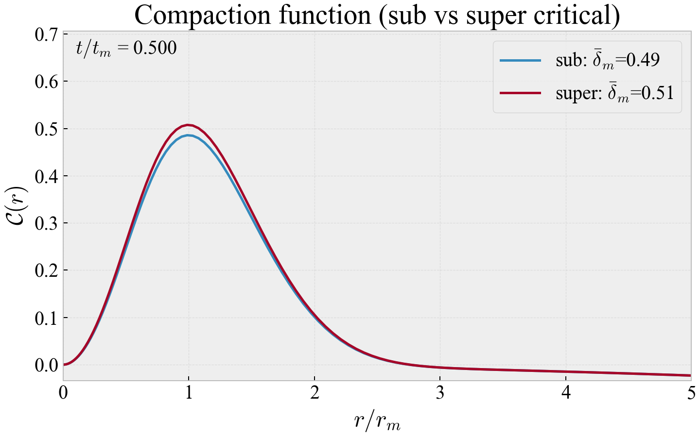

# Primordial Black Hole Capstone Project (PBHCapstone)

## Overview
This project investigates **primordial black holes (PBHs)** — hypothetical black holes formed in the early universe shortly after the Big Bang.  
Unlike stellar black holes, PBHs can span a wide range of masses and may play a role in explaining **dark matter** and early structure formation.

The aim of this project is to explore the **formation, evolution, and consequences** of PBHs through analytical methods and computational modelling.

# Main Results:
Studying the behaviour of the perturbation which either disperses (blue) or collapses (red) into a PBH.

---

## Objectives
- Model the **formation mechanisms** of primordial black holes  
- Investigate the threshold forming a boundary between perturbation dispersion and collapse
- Simulate relevant physical systems (e.g. mass functions, density, velocity dynamics)  
- Develop clear, original and informative visualisations  

---

## Background
Primordial black holes are thought to form from **density fluctuations in the early universe** that collapse under gravity.

They are of particular interest because they may:
- Contribute to **dark matter**
- Produce **gravitational wave signals** through mergers  
- Provide insight into **early-universe physics and inflation**

---
## Pipeline
We study the behaviour within the early radiation-dominated universe governed by the Misner-Sharp equations and the FRW metric. Using cosmological perturbation theeory, we set up the system of equation following a perturbation implicitly parametrised by the threshold, below which will disperse and above which will collapse. We then aim to numerically evolve this system with time and study its dynamics. This is the general numerical pipeline:
- Use the bisection method to study the amplitude of the Compaction Function to find the critical threshold
- Use a Chebyshev polynomial basis to replace spatial derivatives with discrete matrix multiplication
- Apply 4th Order Runge-Kutta to evolve the system with time
- Study subcritical, critical and supercritical cases and understand qualitatively the behaviour associated with each

---
## Structure 
The repository is sectioned as follows:

[`EscrivaCode`](EscrivaCode/) folder contains python files by original author

[`OriginalCode`](OriginalCode/) folder contains our adapted and some original code, in particular associated with producing plots.

[`Plots`](Plots/) folder contains the relevant plots for the paper

[`Presentation and Thesis`](Presentation and Thesis/) folder contains presentation files, large files may require download

[`Sonification`](Sonification/) folder contains animations of the compaction function and overlayed sound files for further analysis of its behaviour (may require download to view)

---
##  Acknowledgements
Refence author's repository:
- https://github.com/albert-escriva/SPriBHoS

